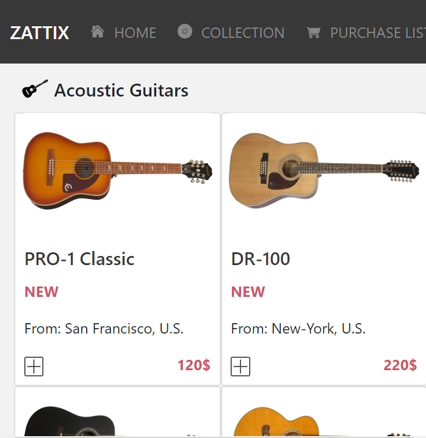

# Capstone project

Layout of Zattix.com web page for study purpose

[Original design](https://www.behance.net/gallery/24796463/ZATTIX)

> This is an assigment for Microverse HTML and CSS Capstone Project. The goal is to make the Zattix.com page with static functionability.

Additional description about the project and its features.

## Built With

- HTML,
- CSS,
- Bootstrap

## Live Demo

[Live Demo (main page)](https://rawcdn.githack.com/NiiazalyDzhumaliev/capstone-project-html-css/3ffe07d403e7449a2f930804d40b0b8868093b6f/index.html)

[Live Demo (search page)](https://rawcdn.githack.com/NiiazalyDzhumaliev/capstone-project-html-css/3ffe07d403e7449a2f930804d40b0b8868093b6f/search.html)

## Getting Started

To get a local copy up and running follow these simple example steps.

### Prerequisites

- A compatible browser with HTML and CSS.

### Install

- Just clone the project

### Usage

- Open the index.html file in any browser or edit using Visual Code or the preference IDE for web development

## Author

👤 **Niiazaly Dzhumaliev**

- Github: [@NiiazalyDzhumaliev](https://github.com/NiiazalyDzhumaliev)
- Twitter: [@Niiazaly1](https://twitter.com/Niiazaly1)
- Linkedin: [@niiazaly-dzhumaliev](https://www.linkedin.com/in/niiazaly-dzhumaliev-117707132/)

## 🤝 Contributing

Contributions, issues and feature requests are welcome!

Feel free to check the [issues page](https://github.com/NiiazalyDzhumaliev/capstone-project-html-css/tree/features).

## Show your support

Give a ⭐️ if you like this project!

## Acknowledgments

- Mohhammed Awad (https://www.behance.net/M_Awad)

## 📝 License

This project is free to use as learning purposes. For any external content (e.g. logo, images, ...), please contact the proper author and check their license of use.
